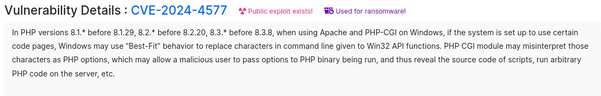

# 💥 PHP CGI Argument Injection - CVE-2024-4577

**Nouvelle CVE sur PHP-CGI**

<figure><figcaption></figcaption></figure>

&#x20;https://censys.com/fr/cve-2024-4577-pt2/&#x20;

https://nvd.nist.gov/vuln/detail/CVE-2024-4577
