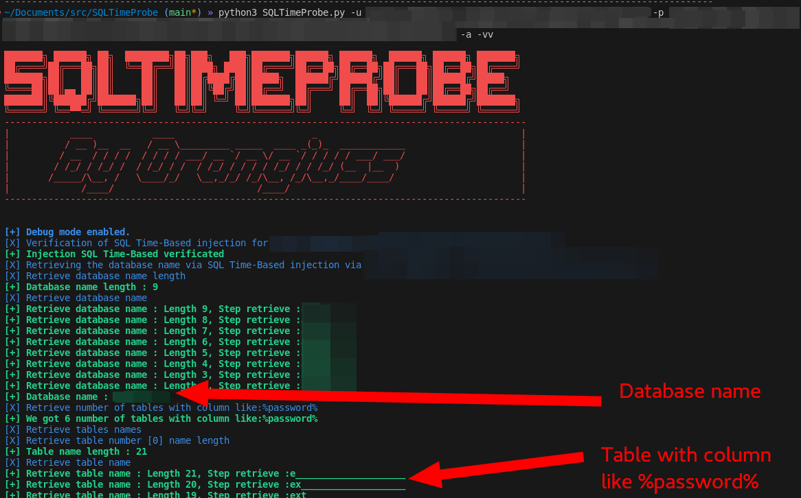

# 🕵️ SQLTimeProbe - Exploit Time-Based SQL Injection

Time-Based SQL Injection is a type of SQL Injection attack that relies on the database management system's (DBMS) time delays to infer information about the database. This script automates the process of exploiting Time-Based SQL Injection vulnerabilities, making it easier to test and secure web applications.

<figure><figcaption></figcaption></figure>
