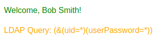
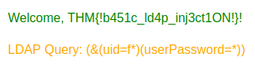
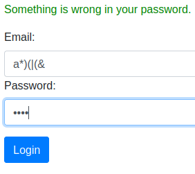
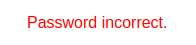

# 💉 TryHackMe -LDAP Injection

💸 **Mentioned Room is Premium type** 💸

## I - Introduction

LDAP, which stands for Lightweight Directory Access Protocol, is a widely used protocol for accessing and maintaining distributed directory information services over an Internet Protocol (IP) network. LDAP enables organizations to manage users centrally, as well as groups and other directory information, often used for authentication and authorization purposes in web and internal applications.

#### Objectives

1. Provide a thorough understanding of LDAP and its role in directory services.
2. Explore the LDAP tree structure and its key components.
3. Introduce LDAP Injection, its impact, and how it can be exploited.
4. Equip participants with the knowledge and skills to identify and mitigate LDAP Injection vulnerabilities.

## II - Structure

## III - Search Queries

## IV - Injection Fundamentals

LDAP Injection is a critical security vulnerability that occurs when user input is not properly sanitized before being incorporated into LDAP queries. This oversight allows attackers to manipulate these queries, leading to unauthorized access or manipulation of the LDAP directory data.

LDAP Injection exploits the way web applications construct LDAP queries. When user input is directly included in these queries without proper validation or encoding, attackers can inject malicious LDAP statements. This can result in unauthorized access to sensitive information, modification of directory data, or bypassing authentication mechanisms.

The process is analogous to SQL Injection, where malicious SQL statements are injected into queries to manipulate database operations. In LDAP Injection, the malicious code targets LDAP queries instead.

#### Common Attack Vectors

1. **Authentication Bypass:** Modifying LDAP authentication queries to log in as another user without knowing their password.
2. **Unauthorized Data Access:** Altering LDAP search queries to retrieve sensitive information not intended for the attacker's access.
3. **Data Manipulation:** Injecting queries that modify the LDAP directory, such as adding or modifying user attributes.

***

## V - Exploiting LDAP

### Authentication Bypass Techniques

**Tautology-Based Injection**

<pre><code><strong>(&#x26;(uid={userInput})(userPassword={passwordInput}))
</strong># A attacker can do for exemple :
(&#x26;(uid=*)(|(&#x26;)(userPassword=pwd)))
</code></pre>

**Wildcard Injection**

<pre><code><strong>(&#x26;(uid={userInput})(userPassword={passwordInput}))
</strong># A attacker can do for exemple :
(&#x26;(uid=*)(userPassword=pwd)))
</code></pre>

#### Authentication Bypass Example

With the site \<IP>/normal.php we can see the LDAP Query when we try to login : &#x20;

<figure><figcaption></figcaption></figure>

We can test with \* and \* for the login/password and we get account of Bob Smith : &#x20;

<figure><figcaption></figcaption></figure>

To get the flag for the challenge we need to target a user starting with the letter f : &#x20;

<figure><figcaption></figcaption></figure>

## VI - Blind LDAP Injection

Blind LDAP Injection is a more subtle variant of LDAP Injection, where the attacker doesn't receive direct output from the injected payload. Instead, they must infer information based on the application's behaviour. This type of attack is more challenging but can still be used to extract sensitive information from an LDAP directory.

Blind LDAP Injection requires a different approach due to the lack of explicit query results. Attackers must rely on indirect signs, such as changes in application behaviour, error messages, or response timings, to deduce the structure of the LDAP query and the existence of vulnerabilities.

When we test with username = a\*)(|($ et password = pwd) : &#x20;

<figure><figcaption></figcaption></figure>

This means that a user starting with the letter a exists.

We can test with ab and we can see a different error message :&#x20;

<figure><figcaption></figcaption></figure>

If we test username=test and password=test we can see that it is the default error message.\
Like that we can enumerate all the username by brute forcing through Blind LDAP Injection.

## VII - Automating the Exploitation

<mark style="color:red;background-color:red;">🚧🚧 In construction 🚧🚧</mark>

## More resources about LDAP Injection

* [https://infosecwriteups.com/ldap-injection-653d7225dd8](https://infosecwriteups.com/ldap-injection-653d7225dd8)
* [https://github.com/swisskyrepo/PayloadsAllTheThings/tree/master/LDAP%20Injection](https://github.com/swisskyrepo/PayloadsAllTheThings/tree/master/LDAP%20Injection)
* [https://book.hacktricks.xyz/pentesting-web/ldap-injection](https://book.hacktricks.xyz/pentesting-web/ldap-injection)
* [https://www.blackhat.com/presentations/bh-europe-08/Alonso-Parada/Whitepaper/bh-eu-08-alonso-parada-WP.pdf](https://www.blackhat.com/presentations/bh-europe-08/Alonso-Parada/Whitepaper/bh-eu-08-alonso-parada-WP.pdf)
* [https://owasp.org/www-community/attacks/LDAP\_Injection](https://owasp.org/www-community/attacks/LDAP\_Injection)

